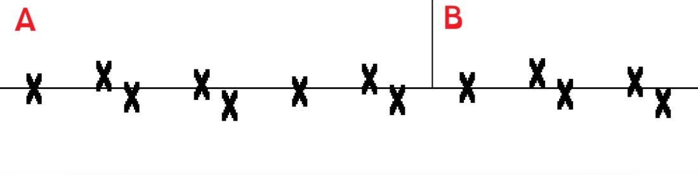
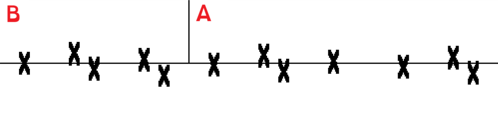

# Where does the X go?

Count the number of Xs in this image
<kbd>  </kbd>
you should have counted thirteen.
Now, swap the positions of tiles A and B.
You'll get the image below. Count again
<kbd>  </kbd>
and you'll find that there are only twelve Xs!
Where did it go?
Try it yourself if you don't believe me, plus, you have the code :)

How it works (spoilers!) 

The Xs in the top image don't have the same shape as the Xs in the bottom image.
The missing X is incorporated into all the others. This is super unintuitive, and how this works is
best understood by explaining how this puzzle is generated.

You start with two full Xs, which you cut at height 45% and 55%.
You position them so that the bottom 45% of one X and the top 45% of the other X end up
at the same horizontal position. Their vertical position is adjusted so that both 45% parts form one
X together, you won't even notice something is missing unless you look closely!
Of course, both 55% parts need to be matched (otherwise you'd have half Xs flying around).
You continue by adding even less to match, e.g. you add 35% of an X to match one of the 55% parts.
Here, also 10% was lost. Creating the 35% Xs means that there are unmatched 65% Xs (if tiles are swapped)
and then you continue matching them with 25%. As you can see, one percentage gets bigger, and the other smaller.
If you continue like this, you'll end up at 90% and 0%, in which case you are done!

Despite knowing how it works, it's still magical and hard to get intuition ...

